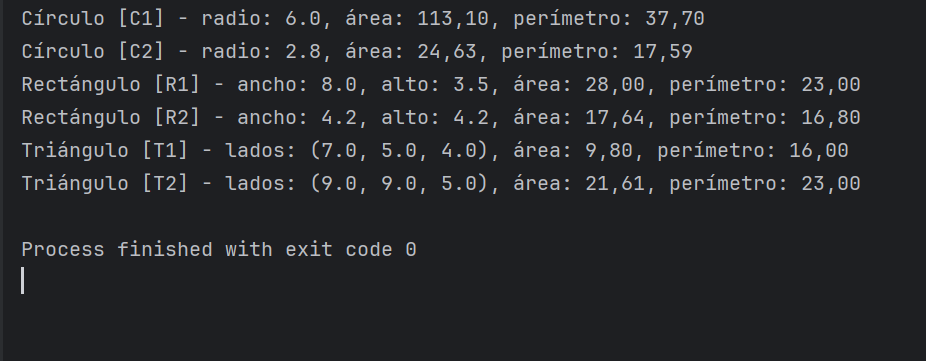

# Taller: Uso de ArrayList con Clases de Figuras en Java

## Breve explicación de la solución implementada
Este proyecto implementa tres clases de figuras geométricas: **Circulo**, **Rectangulo** y **Triangulo**, todas basadas en la interfaz `Figuras`.  
Cada clase define atributos propios (medidas y un nombre identificador) y métodos que permiten calcular el **área**, el **perímetro** y mostrar la información completa de cada objeto.

En la clase `Main`, se crean varios objetos de cada figura y se agregan a un **ArrayList<Figuras>**. Posteriormente, se recorre la lista para mostrar en consola la información y resultados de cada objeto.

## Ejemplo de salida en consola
